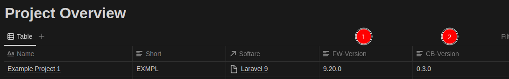

# Notion-Notifier

Keep all your projects and their version under control!

Notion-Notifier is a small package to submit the current versions to a [notion](https://www.notion.so/) page.

The aim is to update the version of the used framework (symfony, pimcore, laravel, drupal...) as well as the version of your codebase (git tag).

The package can be used agnostic or with a little more comfort in laravel. 

## Perparation

This package has list of project in mind, collected in a notion database. In a database, each entry is a distinct notion page with the properties of the database.



In this Example we would have the two columns FW-Version (Framework) and CB-Version (Code-Base) we want to populate on every update with the new, actual values.
To update something, we must have something, meaning:
- Notion account with a project database
- Notion API Secret
- The id of the notion page
- The names of the page properties

## Installation

Use the package manager [composer](https://pip.pypa.io/en/stable/) to install notion-notifier.

```bash
composer require xanobius/notion-notifier
```

## Usage (agnostic)

```php
use Xanobius\NotionNotifier\NotionNotifier;

$notifier = new NotionNotifier;
$notifier->setPageId('[YOUR PAGE ID]');
$notifier->setNotionSecret('[YOUR NOTION SECRET]');

try{
    $notifier->updatePageValue('[PROPERTY NAME]', '[NEW VALUE]');
}catch(Exception $e){
    // do your error handling here
}

```

## Usage in Laravel

Right after the installation, the .env file awaits your settings

```dotenv
NOTION_SECRET=
NOTION_PAGE_ID=
NOTION_LARAVEL_PROP=
NOTION_GIT_PROP=
```

with those options set, one can just call the command

```shell 
php artisan notion-notifier:version
```

The command submits code-base and framework version to the specific properties and can be called after deployment.
To change the behaviour of the package, the config can be published and adjusted to your needs.

```shell
sail artisan vendor:publish --provider="Xanobius\NotionNotifier\NotionNotifierServiceProvider" --tag="config"
```

## Next steps...

Integration for symfony/pimcore projects with config as well.

## Contributing
Pull requests are welcome. For major changes, please open an issue first to discuss what you would like to change.

Please make sure to update tests as appropriate.

## License
[MIT](https://choosealicense.com/licenses/mit/)